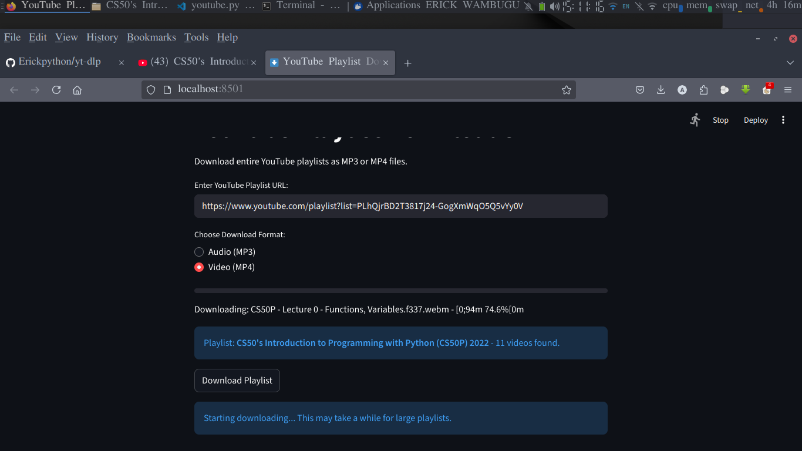

---

# 🎬 Streamlit YouTube Playlist Downloader (yt-dlp)

This is a simple **web-based YouTube Playlist Downloader** built with **Python**, **Streamlit**, and **yt-dlp**.  
It allows users to paste a YouTube playlist link and download all videos directly to their local machine, with real-time progress display and smart resume (skipping already downloaded videos).

---

## 🚀 Features
- 🧠 Paste any YouTube playlist URL and start downloading instantly.
- ⏸️ Automatically skips videos that already exist locally.
- 📊 Displays download progress directly on the Streamlit dashboard.
- ⚙️ Built with modern tools: `Streamlit`, `yt-dlp`, and `Python`.
- 💾 Downloads videos into a structured folder system.
- 📁 Keeps a record of downloaded videos to prevent re-downloading.

---

## 🖼️ Screenshots

### 🎨 Dashboard Interface


### 🧑‍💻 Terminal View (App Running)


> 📸 *Screenshots are stored in the `images/` folder inside this repository.*

---

## 🧩 Folder Structure

yt-dlp/ ├── downloads/              # Downloaded videos │   └── CS50's Introduction to Programming with Python/ │       ├── video1.mp4 │       ├── video2.mp4 │       └── ... │ ├── images/                 # Dashboard and terminal screenshots │   ├── dashboard.png │   └── terminal.png │ ├── YouTube.py              # Main Streamlit app ├── cookies.txt             # Optional: YouTube cookies file ├── README.md               # Project documentation ├── .gitignore              # Ignore unnecessary files └── ytenv/                  # Virtual environment (ignored)

---

## 🧠 How It Works
1. Paste a YouTube **playlist link** into the Streamlit dashboard.  
2. The app uses **yt-dlp** to:
   - Extract playlist information.
   - Download all videos in the best available quality.
   - Skip any videos already downloaded using a local `downloaded_videos.txt` archive.
3. Progress updates and messages are displayed in the app interface.

---

## ⚙️ Setup & Installation

### 1️⃣ Clone the Repository
```bash
git clone https://github.com/YOUR_USERNAME/yt-dlp.git
cd yt-dlp

2️⃣ Create & Activate Virtual Environment

python -m venv ytenv
# On Windows
ytenv\Scripts\activate
# On macOS/Linux
source ytenv/bin/activate

3️⃣ Install Dependencies

pip install streamlit yt-dlp

(Optional: if you have a requirements.txt file, you can run)

pip install -r requirements.txt

4️⃣ Run the Streamlit App

streamlit run YouTube.py


---

🧰 Requirements

Python 3.8+

Streamlit

yt-dlp


---

💡 Future Improvements

Add option to select specific videos from the playlist.

Include audio-only download mode.

Allow login via YouTube cookies for restricted playlists.

Add concurrent downloads for faster performance.

Display download speed and size per video.


---

🧑‍💻 Author

Erick Wambugu
📫 aguerowaza@gmail.com
💻 GitHub Profile


---

🪪 License

This project is open-source and available under the MIT License.


---

> ⚠️ Disclaimer: This tool is for personal and educational use only. Downloading copyrighted material without permission may violate YouTube’s Terms of Service.


---
